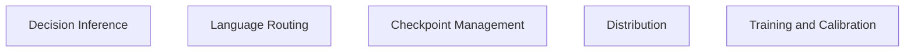
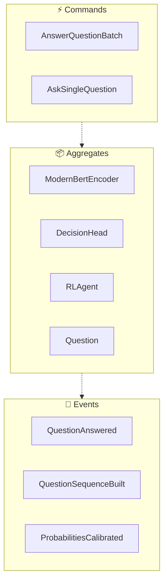
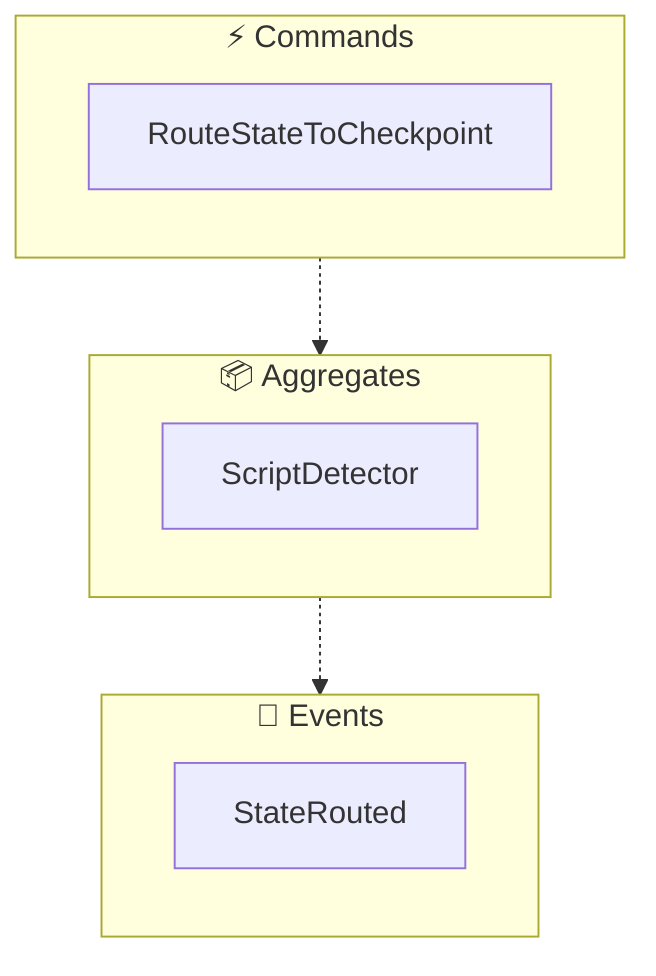
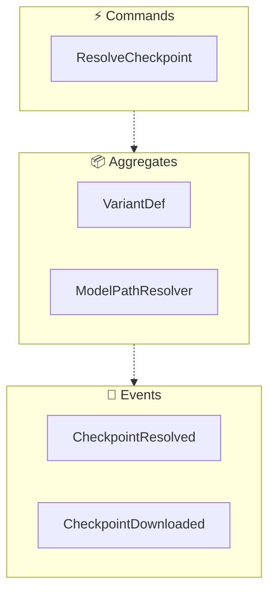
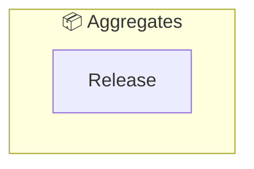
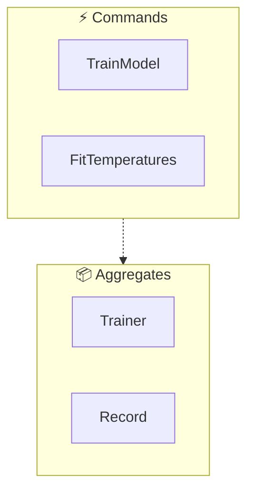

<!-- THIS FILE IS AUTO-GENERATED FROM spec/foundation.json -->
<!-- DO NOT EDIT THIS FILE DIRECTLY -->
<!-- Edit spec/foundation.json and run: fspec generate-foundation-md -->

# rlcd-rs Project Foundation

## Vision

A from-scratch Rust (candle) reimplementation of Laya's sub-35ms, non-autoregressive "System 1" decision engine: give it a state (text, email, ticket, or JSON) and typed questions (choice/score/noul), and it returns typed answers with calibrated probabilities in a single bidirectional forward pass — no text generation, nothing to parse, nothing to hallucinate — usable as a CLI, a Rust library, and in the browser via wasm.

---

## Problem Space

### Typed-decision inference with no Python, no autoregression, and no parseable free text

Rust developers and other non-Python users want Laya's sub-35ms, non-autoregressive "System 1" typed-decision inference (choice/score/noul answers with calibrated probabilities in a single bidirectional forward pass) but the reference implementation is a Python/PyTorch stack: heavyweight to depend on, and unusable where Python isn't available — static CLI binaries, Rust services, or a browser tab. LLM-based classification is a poor substitute: it's autoregressive, generates free text that must be parsed into typed answers, can hallucinate invalid options, and answering a whole question battery against one document costs many generated tokens. A native reimplementation of the published laya checkpoint family (ModernBERT encoder + decision head) on candle, with no PyTorch/Python at inference time, removes all of that.

**Impact:** high

---

## Solution Space

### Overview

rlcd-rs reimplements the full Laya stack natively in Rust on candle: a config-driven ModernBERT encoder (RoPE with per-layer-type theta, alternating global/sliding-window attention, GeGLU MLP), a from-scratch vectorized decision head (type embedding, 2-layer transformer, option-marker scoring, act head), a typed-question schema builder matching the original's sequence layout, per-(question-type, option-count) temperature calibration, an RLCD training loop (REINFORCE with Gaussian exploration + GRPO-style group-mean baseline over the same strictly-proper scoring rule), and script- + language-based routing between the English and multilingual checkpoints. It ships as the rlcd CLI (ask/answer/train), a Rust library, wasm-bindgen bindings for an in-browser demo, and signed distro packages (Homebrew, apt, pacman, archives, crates.io).

### Capabilities

- **Typed Decision Inference**: Answer choice/score/noul questions against a state (text or JSON) in a single bidirectional forward pass, returning typed answers with calibrated probabilities and an act probability
- **Language Checkpoint Routing**: Determine from the state text which checkpoint can actually read it — a fast Unicode script detector plus statistical language ID — and route to the English or multilingual laya checkpoint before inference, so an English-only model can never be confidently wrong on an unreadable script
- **Checkpoint Loading and Download**: Load a published laya checkpoint from disk or in-memory bytes, with a deterministic resolution order (explicit path, family-root subfolder, cached Hugging Face download) and atomic, resume-safe downloads into the XDG cache
- **RLCD Training and Calibration**: Train (fine-tune) the decision model over a JSONL dataset with RLCD: REINFORCE updates with Gaussian-noise exploration and a group-mean baseline over the strictly-proper scoring rule, TD(lambda) bootstrapping for multi-turn episodes, and an act-head auxiliary loss; plus post-hoc per-(question-type, option-count) temperature fitting for calibration

---

## Personas

### Rust Developer

Runs the `rlcd` CLI (ask/answer/train) or depends on the `rlcd-rs` crate from a Rust service

**Goals:**
- Typed-decision inference without a Python/PyTorch dependency
- Fast batch answering of typed question batteries against documents
- Reproducible, packageable deployment (Homebrew/apt/pacman/archives/crates.io)

### End User (browser demo)

Uses the in-browser playground on the rlcd-rs website to build choice/score/noul questions against a document and see typed answers instantly, without installing anything

**Goals:**
- Try the decision engine interactively in the browser (wasm)
- Inspect per-option probabilities and confidence for each question

### ML Engineer

Fine-tunes laya checkpoints on their own JSONL datasets (single-turn records and multi-turn episodes) and calibrates output probabilities before deployment

**Goals:**
- Domain-adapt the model with `rlcd train` over a JSONL dataset
- Fit per-(question-type, option-count) temperatures to cut expected calibration error

---

# Domain Architecture

## Bounded Contexts

- Decision Inference
- Language Routing
- Checkpoint Management
- Distribution
- Training and Calibration

## Bounded Context Map

## Decision Inference Context

### Event Flow

**Aggregates:**
- ModernBertEncoder
- DecisionHead
- RLAgent
- Question

**Domain Events:**
- QuestionAnswered
- QuestionSequenceBuilt
- ProbabilitiesCalibrated

**Commands:**
- AnswerQuestionBatch
- AskSingleQuestion

## Language Routing Context

### Event Flow

**Aggregates:**
- ScriptDetector

**Domain Events:**
- StateRouted

**Commands:**
- RouteStateToCheckpoint

## Checkpoint Management Context

### Event Flow

**Aggregates:**
- VariantDef
- ModelPathResolver

**Domain Events:**
- CheckpointResolved
- CheckpointDownloaded

**Commands:**
- ResolveCheckpoint

## Distribution Context

### Event Flow

**Aggregates:**
- Release

## Training and Calibration Context

### Event Flow

**Aggregates:**
- Trainer
- Record

**Commands:**
- TrainModel
- FitTemperatures

---
